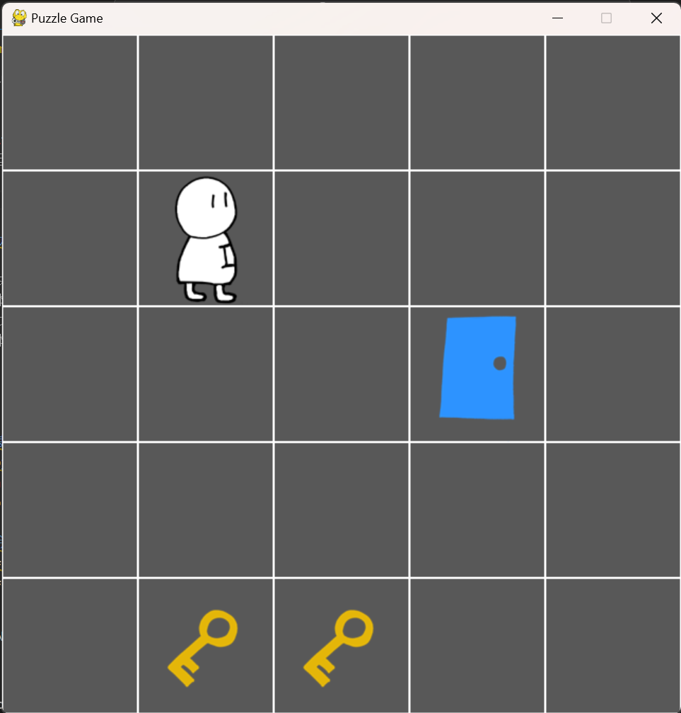

# 「」の物語

Unityで制作予定のゲーム「`「」の物語`」のプロトタイプ  
pygameを用いて作成中

# ゲームの概要

- タイトル（仮）: `「」の物語`
- 本の世界×パズルゲーム
- `「私」`は、「」付きの文字を触ることであらゆるオブジェクトに乗り移ることができる
- 本に書かれたことがゴール条件、かつその通りのことが起こる
  - `「私」`は`「扉」`の先に進んだ
  - `「私」`は`「彼」`と出会った
  - `「箱」`を`「炎」`で燃やすと`「鍵」`が出てきた

# 使用ライブラリ
- pygame
- numpy
- pillow

# 今後の予定
- [ ] https://github.com/Suke-H/kagikkako-python/issues/31
- [ ] https://github.com/Suke-H/kagikkako-python/issues/33
- [ ] https://github.com/Suke-H/kagikkako-python/issues/34
- [ ] https://github.com/Suke-H/kagikkako-python/issues/16
- [ ] https://github.com/Suke-H/kagikkako-python/issues/12
- [ ] https://github.com/Suke-H/kagikkako-python/issues/32
